# Hotel Price Predictor
### by John Millar, Kalen Asberry and Mark Foxworth

## Summary and Goal of Project

> Using Kaggle’s Hotel Booking Demand dataset, this project seeks to examine:
* Key features in determining hotel prices
* Best times to travel abroad  to save money on hotels
* Target is Average Daily Rate (adr)

> The project will utilize various data cleaning and machine learning techniques to determine which model most accurately predicts hotel prices.
* Random Forest Model
* Gradient Boosting
* Linear Regression
* ARIMA
* Decisin Tree
* Deep Learning
* K-nearest neighbors

## Questions of the Data:

> What data features have the most impact on hotel price?
* Lead Time (if it's a City Hotel)
* Arrival Date (Week / Month)

> Is there true cost savings in booking a hotel well in advance? 
* Yes, but only for City Hotels

> When is the best time to travel to save money on hotels?
* Off Season, especially for Resort Hotels

> Can this data be used to build a machine learning model to accurately predict hotel prices? 
* Yes with a margin of error or $10 to $20 per night

## Data Cleaning Process

Steps (Combine columns and drop unnecessary data):
* Arrival month was converted to numerical values
* Arrival day, month, and year were combined in a new row labeled date.
* All daily rates less than $40 to $50 were eliminated to remove discounted prices.
* Market segments such as aviation, corporate, undefined and complementary rates were dropped to reduce noise and focus on standard consumer rates
* Other features were dropped
* Null values were dropped
* Transformed non-numeric data using one-hot-encoder and labeling
* Rounded average daily rate (ADR) to the nearest $10 dollars to simplify model predictions
* Additional filter options to sort data by country and 
* Split City and Resort Hotels for comparision
* Use standard scaler to normalize the final data frame

> Data frame cleaned to 116,000 rows with 13 columns.
> City Hotels made up about two thirds and Resorts made up the other third.

## Best Time to Travel: Average Weekly Rates

Data indicates the best time to travel to save money is during the non peak times such as winter and early Spring with a general upward trend in the City hotel prices over time.
High seasonality in the resort hotel data with high peaks and valleys with peak time in the summer / late fall months.

# Lead Time & ADR

Average daily rate was calculated for each day of lead time.  There is a linear relationship between lead time and ADR per the City Hotel data but there is not a strong linear relationship with the Resort Data.  This would indicate that booking a city hotel early can impact price.  

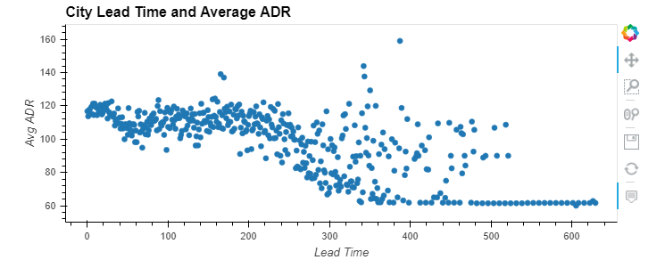

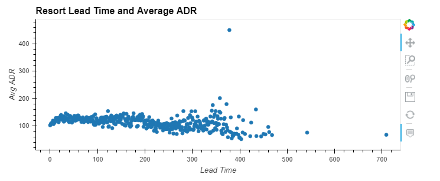

### Average Weekly Rates
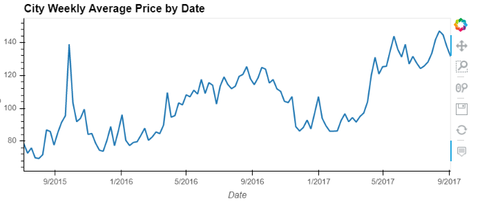

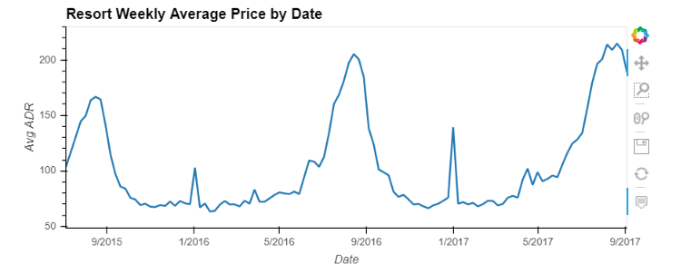

### Process
* Data split by City and Resort Hotel
* Resampled based on a weekly average

## Random Forest Model / Gradient Boosting

Using Random Forest and Gradient Boosting we can predict the exact price a quarter of the time, but almost all predictions are within a $50 range. 
When we break the pricing into ranges, then our accuracy in predicting the correct bucket is above 70 percent.

### Features with most weight:
* Lead Time
* Arrival Date (Week)
* Arrival Date (Month)
* Country (Filtered by country, we can predict the exact price third of the time)

### Price prediction for Brazil (Hotel and Resorts)
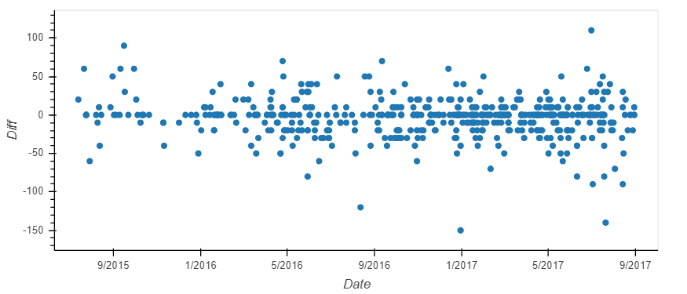

### Price prediction for all countries
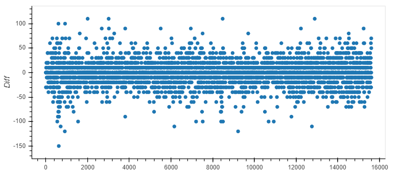

### Price 

## Linear Regression & K Nearest Neighbor

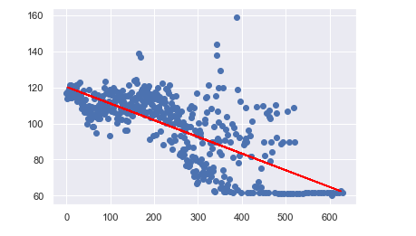

MSE of 15.38

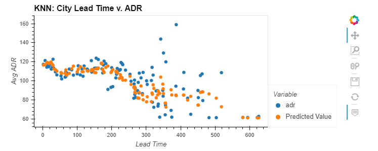

MSE of 15.06

## ARIMA Model
Filtered by country (Brazil)
To be finalized
With seasonal events this autocorrelations has spikes due to some invents such as Carnival and Olympics.

Due to the high volume of people and major events during certain time of the year the means of the Autocorrelation are higher but as time goes on there is not as much traffic the mean will eventually go negative.

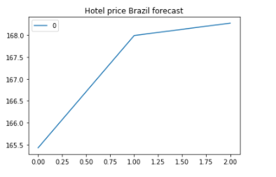

## Decision-Trees
This Decision Tree showed us some surprising data, the must important feature with .47 out of 1 being arrival data week number. That make more sense when Brazil has the most traction of hotel and resort visitors during certain time of the year Such as Olympics and Carnival. Making the tree look at the weeks with the most volume of the outcomes.

## Deep Learning Techniques

Results indicate the model is within $100 dollars of the actual value which is not accurate. 

### Process - ran two models with following:
* Epochs = 100
* Features = 15
* Nodes = 8
* Activation = Linear
* MSE = 572 (Best Model)

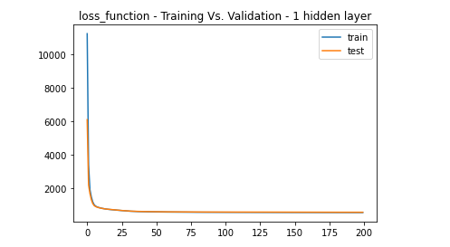

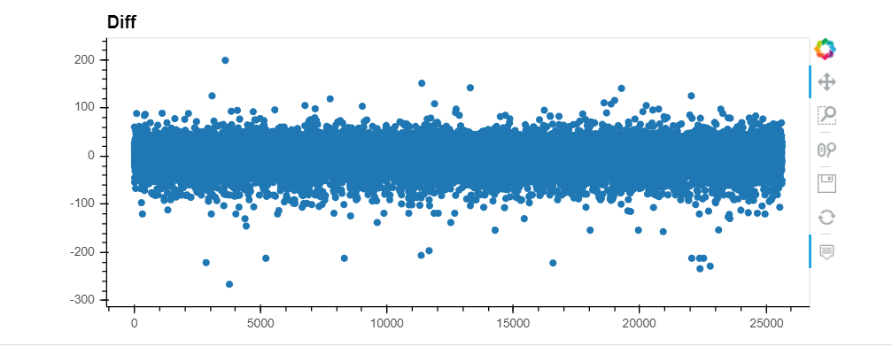

## Final Results

The Classifier models with current data, can accurately predict the exact price 25 to 31 percent, and most prices are within a $50 range.
The accuracy of the Classifier models increase to over 70 percent when the prices are grouped into 4 price ranges.
Deep learning model was not accurate with a mse of 654.  Significant variances between predicted and actual adr values.
There is a correlation between cost and lead time (Random Forest Weights).

## Lessons Learned

More Detailed Data
* More granular data (hotel location)
* Start Ratings
More memory
* Dataset size caused significant slowdowns on machines
* Had to filter data to run due to size

## Data Source

Hotel Booking Demand Data 
Source – Kaggle
https://www.kaggle.com/jessemostipak/hotel-booking-demand/data#nd
Description:
* ~119,000 rows of data with 32 columns.  
* Data includes Average Daily Rates, meal plan, country, lead time, booking date and hotel types.
